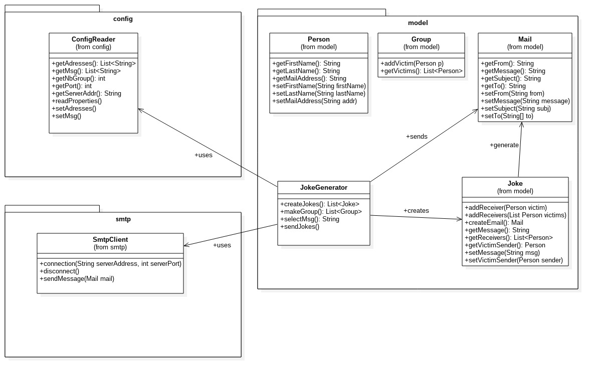

# Teaching-HEIGVD-RES-2016-Labo-SMTP

## Authors

* URL repo : 
* Combremont Rosanne, rosanne.combremont@heig-vd.ch
* Ponce Kevin, kevin.ponce@heig-vd.ch

## Description
In this lab, we have developped a client application in java. This client application use the Socket API to communicate with a SMTP server.
The client application plays automatically pranks on a list of victims. The application read a file with all e-mail address and choose victims.
The client application choose random e-mails and a random message. We use a random function to choose the sender and recipients. 

##Installation
To run our application enter the following command in the Labo-SMTP/dist:
* java -jar Labo-SMTP.jar
Make sure first to edit the config/ files:
* in config.properties set the server properties and the number of group you want to create
* in message.utf8 write the messages. Be sure to follow the shown structure exemple
* in victims.utf8 list the email addresses (firstname.lastname@blabla.com)

##Diagram of classes

There are 4 packages.
* SMTP client to communicate with the SMTP server
* model with all classes to manage joke person and group
* config to read the configuration files
* smtp with the main class

##Implementation
To begin we initialize a list of all e-mail addresses available and a list for all messages
To complete e-mail address list we read victims.utf8 and for message list message.utf8

We use a file properties for default values (server address, port and number of group).
When the application start we read the whole file configuration. Then we start the communication with the server.

After that we call JokeGenerator class. This class create groups by choosing random e-mail in the address list.
Furthermore we create the joke. We choose a random sender in the group list and define victims. We choose the message to send too.

Then for each joke we send all email.
When all are sended we close the socket and out/in buffer

## Mock server
In this lab we use an OpenSource Mock smtp server. 
* https://github.com/tweakers-dev/MockMock
A smtp mock server intercept emails and by using the web interface we can see emails send. With Mock server we can work on local machine
this fake server doesn't have all security.

After downloaded the repository, use the maven command line to build and launch test
* mvn clean install 

Then execute the next line command(execute the jar file) to run the smtp mock server. -p the port listen by the smtp server
* java -jar MockMock-1.4.0.one-jar.jar -p 2525

After all this step we are able to open a connection with smtp mock server with the next command line.
* telnet localhost 2525

## Test
We have checked our client application by using smtp mock server and the HEIG smtp server.
* localhost 2525 smtp mock server (set in config.properties: localhost and 2525)
* stmp.heig-vd.ch 25 HEIG stmp server (set in config.properties: smtp.heig-vd.ch and 25)

Test passed with both server

